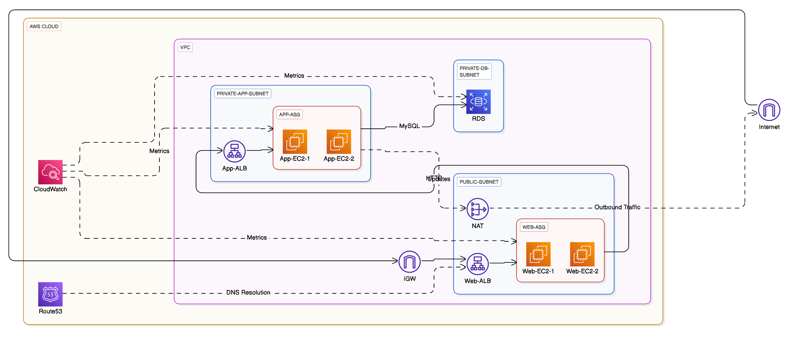

# Success Messsage [Infra Deployment Complete]

Apply complete! Resources: 45 added, 0 changed, 0 destroyed.

Outputs:

```
app_internal_dns = "app.internal.three-tier-app.com"
db_endpoint = "three-tier-app-db.c7iikg64q9sj.ap-southeast-1.rds.amazonaws.com:3306"
private_zone_id = "Z06428793TC5WV8UPI61U"
vpc_id = "vpc-04d50035dbc3e7e16"
web_alb_dns = "three-tier-app-web-alb-850893357.ap-southeast-1.elb.amazonaws.com"
```

# Step by Step Code Implementation Guide

## Step 1: Initial Setup and Provider Configuration

1. First, create the provider configuration:

```hcl
# File: provider.tf

# Specify required providers and their versions
terraform {
  required_providers {
    aws = {
      source  = "hashicorp/aws"
      version = "~> 4.0"
    }
  }
}

# Configure the AWS Provider
provider "aws" {
  region = "ap-southeast-1"  # Singapore region
}
```

This sets up:

- The AWS provider requirement
- Version constraint for stability
- Singapore region specification

2. Create the variables file:

```hcl
# File: variables.tf

# Environment name variable
variable "environment" {
  description = "Environment name"
  default     = "prod"
}

# Application name variable
variable "app_name" {
  description = "Application name"
  default     = "three-tier-app"
}

# VPC CIDR range
variable "vpc_cidr" {
  description = "CIDR block for VPC"
  default     = "10.16.0.0/16"  # Allows for 65,536 IP addresses
}

# Subnet CIDR ranges
variable "public_subnet_cidrs" {
  description = "CIDR blocks for public subnets (web tier)"
  type        = list(string)
  default     = [
    "10.16.0.0/24",   # 256 IPs for public subnet in AZ1
    "10.16.1.0/24"    # 256 IPs for public subnet in AZ2
  ]
}

variable "app_subnet_cidrs" {
  description = "CIDR blocks for application tier private subnets"
  type        = list(string)
  default     = [
    "10.16.10.0/23",  # 512 IPs for app subnet in AZ1
    "10.16.12.0/23"   # 512 IPs for app subnet in AZ2
  ]
}

variable "db_subnet_cidrs" {
  description = "CIDR blocks for database tier private subnets"
  type        = list(string)
  default     = [
    "10.16.20.0/24",  # 256 IPs for db subnet in AZ1
    "10.16.21.0/24"   # 256 IPs for db subnet in AZ2
  ]
}

variable "availability_zones" {
  description = "AZs in Singapore region"
  type        = list(string)
  default     = ["ap-southeast-1a", "ap-southeast-1b"]
}

# Database credentials
variable "db_username" {
  description = "Database administrator username"
  type        = string
  default     = "admin"
}

variable "db_password" {
  description = "Database administrator password"
  type        = string
  sensitive   = true
}
```

This defines:

- All required variables with descriptions
- Default values where appropriate
- CIDR ranges for network segmentation
- Sensitive flags for credentials

## Step 2: VPC and Network Infrastructure

1. Create the VPC:

```hcl
# File: networking.tf

# Create VPC
resource "aws_vpc" "main" {
  cidr_block           = var.vpc_cidr
  enable_dns_hostnames = true
  enable_dns_support   = true

  tags = {
    Name        = "${var.app_name}-vpc"
    Environment = var.environment
  }
}
```

This creates:

- A VPC with the specified CIDR range
- DNS support enabled
- Proper tagging

2. Create the subnets:

```hcl
# Public subnets for web tier
resource "aws_subnet" "public" {
  count             = length(var.public_subnet_cidrs)
  vpc_id            = aws_vpc.main.id
  cidr_block        = var.public_subnet_cidrs[count.index]
  availability_zone = var.availability_zones[count.index]

  map_public_ip_on_launch = true  # Auto-assign public IPs

  tags = {
    Name        = "${var.app_name}-public-${count.index + 1}"
    Tier        = "web"
    Environment = var.environment
  }
}

# Private subnets for application tier
resource "aws_subnet" "private_app" {
  count             = length(var.app_subnet_cidrs)
  vpc_id            = aws_vpc.main.id
  cidr_block        = var.app_subnet_cidrs[count.index]
  availability_zone = var.availability_zones[count.index]

  tags = {
    Name        = "${var.app_name}-private-app-${count.index + 1}"
    Tier        = "app"
    Environment = var.environment
  }
}

# Private subnets for database tier
resource "aws_subnet" "private_db" {
  count             = length(var.db_subnet_cidrs)
  vpc_id            = aws_vpc.main.id
  cidr_block        = var.db_subnet_cidrs[count.index]
  availability_zone = var.availability_zones[count.index]

  tags = {
    Name        = "${var.app_name}-private-db-${count.index + 1}"
    Tier        = "db"
    Environment = var.environment
  }
}
```

This creates:

- Public subnets for the web tier
- Private subnets for the application tier
- Private subnets for the database tier
- Each subnet in different AZs for high availability

3. Create Internet Gateway and NAT Gateway:

```hcl
# Internet Gateway for public subnets
resource "aws_internet_gateway" "main" {
  vpc_id = aws_vpc.main.id

  tags = {
    Name        = "${var.app_name}-igw"
    Environment = var.environment
  }
}

# Elastic IP for NAT Gateway
resource "aws_eip" "nat" {
  vpc = true

  tags = {
    Name        = "${var.app_name}-nat-eip"
    Environment = var.environment
  }

  depends_on = [aws_internet_gateway.main]
}

# NAT Gateway for private subnets
resource "aws_nat_gateway" "main" {
  allocation_id = aws_eip.nat.id
  subnet_id     = aws_subnet.public[0].id  # Place in first public subnet

  tags = {
    Name        = "${var.app_name}-nat"
    Environment = var.environment
  }
}
```

This creates:

- Internet Gateway for public internet access
- NAT Gateway for private subnet internet access
- Elastic IP for the NAT Gateway

4. Create Route Tables:

```hcl
# Public route table
resource "aws_route_table" "public" {
  vpc_id = aws_vpc.main.id

  route {
    cidr_block = "0.0.0.0/0"
    gateway_id = aws_internet_gateway.main.id
  }

  tags = {
    Name        = "${var.app_name}-public-rt"
    Environment = var.environment
  }
}

# Private route table
resource "aws_route_table" "private" {
  vpc_id = aws_vpc.main.id

  route {
    cidr_block     = "0.0.0.0/0"
    nat_gateway_id = aws_nat_gateway.main.id
  }

  tags = {
    Name        = "${var.app_name}-private-rt"
    Environment = var.environment
  }
}
```

This creates:

- Public route table with Internet Gateway route
- Private route table with NAT Gateway route

5. Associate Route Tables with Subnets:

```hcl
# Public subnet associations
resource "aws_route_table_association" "public" {
  count          = length(var.public_subnet_cidrs)
  subnet_id      = aws_subnet.public[count.index].id
  route_table_id = aws_route_table.public.id
}

# Private subnet associations for app tier
resource "aws_route_table_association" "private_app" {
  count          = length(var.app_subnet_cidrs)
  subnet_id      = aws_subnet.private_app[count.index].id
  route_table_id = aws_route_table.private.id
}

# Private subnet associations for db tier
resource "aws_route_table_association" "private_db" {
  count          = length(var.db_subnet_cidrs)
  subnet_id      = aws_subnet.private_db[count.index].id
  route_table_id = aws_route_table.private.id
}
```

This:

- Associates public subnets with public route table
- Associates private subnets with private route table

# Step 3: Security Configuration

1. Create Security Groups:

```hcl
# File: security.tf

# Web Tier Security Group
resource "aws_security_group" "web" {
  name        = "${var.app_name}-web-sg"
  description = "Security group for web tier"
  vpc_id      = aws_vpc.main.id

  # Allow HTTPS from anywhere
  ingress {
    from_port   = 443
    to_port     = 443
    protocol    = "tcp"
    cidr_blocks = ["0.0.0.0/0"]
    description = "Allow HTTPS inbound"
  }

  # Allow HTTP from anywhere (consider removing in production)
  ingress {
    from_port   = 80
    to_port     = 80
    protocol    = "tcp"
    cidr_blocks = ["0.0.0.0/0"]
    description = "Allow HTTP inbound"
  }

  # Allow outbound only to application tier
  egress {
    from_port       = 8080
    to_port         = 8080
    protocol        = "tcp"
    cidr_blocks     = var.app_subnet_cidrs
    description     = "Allow outbound to application tier"
  }

  # Allow outbound HTTPS for patches and updates
  egress {
    from_port   = 443
    to_port     = 443
    protocol    = "tcp"
    cidr_blocks = ["0.0.0.0/0"]
    description = "Allow HTTPS outbound for updates"
  }

  tags = {
    Name        = "${var.app_name}-web-sg"
    Environment = var.environment
  }
}

# Application Tier Security Group
resource "aws_security_group" "app" {
  name        = "${var.app_name}-app-sg"
  description = "Security group for application tier"
  vpc_id      = aws_vpc.main.id

  # Allow inbound only from web tier
  ingress {
    from_port       = 8080
    to_port         = 8080
    protocol        = "tcp"
    cidr_blocks     = var.public_subnet_cidrs
    description     = "Allow inbound from web tier"
  }

  # Allow outbound only to database tier
  egress {
    from_port       = 3306
    to_port         = 3306
    protocol        = "tcp"
    cidr_blocks     = var.db_subnet_cidrs
    description     = "Allow outbound to database tier"
  }

  # Allow outbound HTTPS for patches and updates
  egress {
    from_port   = 443
    to_port     = 443
    protocol    = "tcp"
    cidr_blocks = ["0.0.0.0/0"]
    description = "Allow HTTPS outbound for updates"
  }

  tags = {
    Name        = "${var.app_name}-app-sg"
    Environment = var.environment
  }
}

# Database Tier Security Group
resource "aws_security_group" "db" {
  name        = "${var.app_name}-db-sg"
  description = "Security group for database tier"
  vpc_id      = aws_vpc.main.id

  # Allow inbound only from application tier
  ingress {
    from_port       = 3306
    to_port         = 3306
    protocol        = "tcp"
    cidr_blocks     = var.app_subnet_cidrs
    description     = "Allow inbound from application tier"
  }

  # No direct outbound internet access
  egress {
    from_port       = 0
    to_port         = 0
    protocol        = "-1"
    cidr_blocks     = var.app_subnet_cidrs
    description     = "Allow outbound only to application tier"
  }

  tags = {
    Name        = "${var.app_name}-db-sg"
    Environment = var.environment
  }
}
```

# Step 4: IAM Configuration

1. Create IAM Roles and Policies:

```hcl
# File: iam.tf

# IAM Role for EC2 instances in Application Tier
resource "aws_iam_role" "app_role" {
  name = "${var.app_name}-app-role"

  assume_role_policy = jsonencode({
    Version = "2012-10-17"
    Statement = [
      {
        Action = "sts:AssumeRole"
        Effect = "Allow"
        Principal = {
          Service = "ec2.amazonaws.com"
        }
      }
    ]
  })

  tags = {
    Name        = "${var.app_name}-app-role"
    Environment = var.environment
  }
}

# IAM Instance Profile
resource "aws_iam_instance_profile" "app_profile" {
  name = "${var.app_name}-app-profile"
  role = aws_iam_role.app_role.name
}

# Attach needed AWS managed policies
resource "aws_iam_role_policy_attachment" "app_policy" {
  for_each = toset([
    "arn:aws:iam::aws:policy/AmazonRDSReadOnlyAccess",
    "arn:aws:iam::aws:policy/CloudWatchAgentServerPolicy",
    "arn:aws:iam::aws:policy/AmazonS3ReadOnlyAccess"
  ])

  role       = aws_iam_role.app_role.name
  policy_arn = each.value
}
```

# Step 5: Compute Resources Configuration

1. Create Launch Templates:

```hcl
# File: compute.tf

# Launch Template for Web Tier
resource "aws_launch_template" "web" {
  name_prefix   = "${var.app_name}-web-"
  image_id      = "ami-0df7a207adb9748c7"  # Amazon Linux 2 AMI in ap-southeast-1
  instance_type = "t3.micro"

  # Network configuration
  network_interfaces {
    associate_public_ip_address = true
    security_groups            = [aws_security_group.web.id]
  }

  # User data script
  user_data = base64encode(<<-EOF
              #!/bin/bash
              yum update -y
              yum install -y httpd
              systemctl start httpd
              systemctl enable httpd
              # Install CloudWatch agent
              yum install -y amazon-cloudwatch-agent
              /opt/aws/amazon-cloudwatch-agent/bin/amazon-cloudwatch-agent-ctl -a fetch-config -m ec2 -s -c ssm:AmazonCloudWatch-Config
              EOF
  )

  monitoring {
    enabled = true
  }

  # Add tags to instances
  tag_specifications {
    resource_type = "instance"
    tags = {
      Name        = "${var.app_name}-web"
      Environment = var.environment
      Tier        = "web"
    }
  }

  lifecycle {
    create_before_destroy = true
  }
}

# Launch Template for Application Tier
resource "aws_launch_template" "app" {
  name_prefix   = "${var.app_name}-app-"
  image_id      = "ami-0df7a207adb9748c7"  # Amazon Linux 2 AMI in ap-southeast-1
  instance_type = "t3.small"

  # Network configuration
  network_interfaces {
    security_groups = [aws_security_group.app.id]
  }

  # IAM Instance Profile
  iam_instance_profile {
    name = aws_iam_instance_profile.app_profile.name
  }

  # User data script
  user_data = base64encode(<<-EOF
              #!/bin/bash
              yum update -y
              yum install -y java-11-amazon-corretto
              # Install CloudWatch agent
              yum install -y amazon-cloudwatch-agent
              /opt/aws/amazon-cloudwatch-agent/bin/amazon-cloudwatch-agent-ctl -a fetch-config -m ec2 -s -c ssm:AmazonCloudWatch-Config
              EOF
  )

  monitoring {
    enabled = true
  }

  # Add tags to instances
  tag_specifications {
    resource_type = "instance"
    tags = {
      Name        = "${var.app_name}-app"
      Environment = var.environment
      Tier        = "app"
    }
  }

  lifecycle {
    create_before_destroy = true
  }
}
```

2. Create Auto Scaling Groups:

```hcl
# Auto Scaling Group for Web Tier
resource "aws_autoscaling_group" "web" {
  name                = "${var.app_name}-web-asg"
  desired_capacity    = 2
  max_size           = 4
  min_size           = 1
  target_group_arns  = [aws_lb_target_group.web.arn]
  vpc_zone_identifier = aws_subnet.public[*].id
  health_check_type  = "ELB"
  health_check_grace_period = 300

  launch_template {
    id      = aws_launch_template.web.id
    version = "$Latest"
  }

  tag {
    key                 = "Name"
    value               = "${var.app_name}-web"
    propagate_at_launch = true
  }
}

# Auto Scaling Group for Application Tier
resource "aws_autoscaling_group" "app" {
  name                = "${var.app_name}-app-asg"
  desired_capacity    = 2
  max_size           = 4
  min_size           = 1
  target_group_arns  = [aws_lb_target_group.app.arn]
  vpc_zone_identifier = aws_subnet.private_app[*].id
  health_check_type  = "ELB"
  health_check_grace_period = 300

  launch_template {
    id      = aws_launch_template.app.id
    version = "$Latest"
  }

  tag {
    key                 = "Name"
    value               = "${var.app_name}-app"
    propagate_at_launch = true
  }
}
```

This configuration:

1. Sets up security groups with proper inbound/outbound rules for each tier
2. Creates IAM roles with necessary permissions for the application tier
3. Configures launch templates with proper user data scripts and settings
4. Sets up auto scaling groups with proper health checks and scaling configurations

# Step 6: Load Balancer Configuration

```hcl
# File: loadbalancer.tf

# Application Load Balancer for Web Tier
resource "aws_lb" "web" {
  name               = "${var.app_name}-web-alb"
  internal           = false
  load_balancer_type = "application"
  security_groups    = [aws_security_group.web.id]
  subnets           = aws_subnet.public[*].id

  enable_deletion_protection = true

  access_logs {
    bucket  = aws_s3_bucket.alb_logs.id
    prefix  = "web-alb-logs"
    enabled = true
  }

  tags = {
    Name        = "${var.app_name}-web-alb"
    Environment = var.environment
  }
}

# Application Load Balancer for Application Tier
resource "aws_lb" "app" {
  name               = "${var.app_name}-app-alb"
  internal           = true
  load_balancer_type = "application"
  security_groups    = [aws_security_group.app.id]
  subnets           = aws_subnet.private_app[*].id

  enable_deletion_protection = true

  access_logs {
    bucket  = aws_s3_bucket.alb_logs.id
    prefix  = "app-alb-logs"
    enabled = true
  }

  tags = {
    Name        = "${var.app_name}-app-alb"
    Environment = var.environment
  }
}

# Target Groups
resource "aws_lb_target_group" "web" {
  name     = "${var.app_name}-web-tg"
  port     = 80
  protocol = "HTTP"
  vpc_id   = aws_vpc.main.id

  health_check {
    enabled             = true
    healthy_threshold   = 3
    interval            = 30
    matcher            = "200"
    path               = "/health"
    port               = "traffic-port"
    protocol           = "HTTP"
    timeout            = 5
    unhealthy_threshold = 2
  }

  tags = {
    Name        = "${var.app_name}-web-tg"
    Environment = var.environment
  }
}

resource "aws_lb_target_group" "app" {
  name     = "${var.app_name}-app-tg"
  port     = 8080
  protocol = "HTTP"
  vpc_id   = aws_vpc.main.id

  health_check {
    enabled             = true
    healthy_threshold   = 3
    interval            = 30
    matcher            = "200"
    path               = "/health"
    port               = "traffic-port"
    protocol           = "HTTP"
    timeout            = 5
    unhealthy_threshold = 2
  }

  tags = {
    Name        = "${var.app_name}-app-tg"
    Environment = var.environment
  }
}

# Listeners
resource "aws_lb_listener" "web_http" {
  load_balancer_arn = aws_lb.web.arn
  port              = "80"
  protocol          = "HTTP"

  default_action {
    type             = "forward"
    target_group_arn = aws_lb_target_group.web.arn
  }
}

resource "aws_lb_listener" "app_http" {
  load_balancer_arn = aws_lb.app.arn
  port              = "8080"
  protocol          = "HTTP"

  default_action {
    type             = "forward"
    target_group_arn = aws_lb_target_group.app.arn
  }
}

# S3 bucket for ALB logs
resource "aws_s3_bucket" "alb_logs" {
  bucket = "${var.app_name}-alb-logs-${data.aws_caller_identity.current.account_id}"

  tags = {
    Name        = "${var.app_name}-alb-logs"
    Environment = var.environment
  }
}

# Bucket policy for ALB logs
resource "aws_s3_bucket_policy" "alb_logs" {
  bucket = aws_s3_bucket.alb_logs.id

  policy = jsonencode({
    Version = "2012-10-17"
    Statement = [
      {
        Effect = "Allow"
        Principal = {
          AWS = "arn:aws:iam::${data.aws_elb_service_account.main.id}:root"
        }
        Action = "s3:PutObject"
        Resource = "${aws_s3_bucket.alb_logs.arn}/*"
      }
    ]
  })
}
```

# Step 7: Database Configuration

```hcl
# File: database.tf

# RDS Subnet Group
resource "aws_db_subnet_group" "main" {
  name       = "${var.app_name}-db-subnet-group"
  subnet_ids = aws_subnet.private_db[*].id

  tags = {
    Name        = "${var.app_name}-db-subnet-group"
    Environment = var.environment
  }
}

# RDS Parameter Group
resource "aws_db_parameter_group" "main" {
  family = "mysql8.0"
  name   = "${var.app_name}-db-params"

  parameter {
    name  = "character_set_server"
    value = "utf8mb4"
  }

  parameter {
    name  = "character_set_client"
    value = "utf8mb4"
  }

  tags = {
    Name        = "${var.app_name}-db-params"
    Environment = var.environment
  }
}

# RDS Instance
resource "aws_db_instance" "main" {
  identifier           = "${var.app_name}-db"
  allocated_storage    = 20
  storage_type        = "gp3"
  engine              = "mysql"
  engine_version      = "8.0"
  instance_class      = "db.t3.micro"
  db_name             = "appdb"
  username            = var.db_username
  password            = var.db_password

  # High Availability
  multi_az               = true
  availability_zone      = var.availability_zones[0]

  # Network
  db_subnet_group_name   = aws_db_subnet_group.main.name
  vpc_security_group_ids = [aws_security_group.db.id]

  # Backup and Maintenance
  backup_retention_period   = 7
  backup_window            = "03:00-04:00"
  maintenance_window       = "Mon:04:00-Mon:05:00"

  # Performance and Monitoring
  monitoring_interval      = 60
  monitoring_role_arn     = aws_iam_role.rds_monitoring_role.arn
  enabled_cloudwatch_logs_exports = ["error", "general", "slowquery"]

  # Security
  storage_encrypted       = true
  parameter_group_name   = aws_db_parameter_group.main.name
  skip_final_snapshot    = false
  final_snapshot_identifier = "${var.app_name}-db-final-snapshot"

  tags = {
    Name        = "${var.app_name}-db"
    Environment = var.environment
  }
}

# RDS Monitoring Role
resource "aws_iam_role" "rds_monitoring_role" {
  name = "${var.app_name}-rds-monitoring-role"

  assume_role_policy = jsonencode({
    Version = "2012-10-17"
    Statement = [
      {
        Action = "sts:AssumeRole"
        Effect = "Allow"
        Principal = {
          Service = "monitoring.rds.amazonaws.com"
        }
      }
    ]
  })
}

resource "aws_iam_role_policy_attachment" "rds_monitoring_policy" {
  role       = aws_iam_role.rds_monitoring_role.name
  policy_arn = "arn:aws:iam::aws:policy/service-role/AmazonRDSEnhancedMonitoringRole"
}
```

# Step 8: DNS Configuration

```hcl
# File: dns.tf

# Private Hosted Zone
resource "aws_route53_zone" "private" {
  name = "internal.${var.app_name}.com"

  vpc {
    vpc_id = aws_vpc.main.id
  }

  tags = {
    Name        = "${var.app_name}-private-zone"
    Environment = var.environment
  }
}

# DNS Records
resource "aws_route53_record" "app" {
  zone_id = aws_route53_zone.private.zone_id
  name    = "app.internal.${var.app_name}.com"
  type    = "A"

  alias {
    name                   = aws_lb.app.dns_name
    zone_id                = aws_lb.app.zone_id
    evaluate_target_health = true
  }
}

resource "aws_route53_record" "db" {
  zone_id = aws_route53_zone.private.zone_id
  name    = "db.internal.${var.app_name}.com"
  type    = "CNAME"
  ttl     = "300"
  records = [aws_db_instance.main.address]
}
```

# Step 9: Monitoring Configuration

```hcl
# File: monitoring.tf

# CloudWatch Log Groups
resource "aws_cloudwatch_log_group" "app_logs" {
  name              = "/aws/ec2/${var.app_name}"
  retention_in_days = 30

  tags = {
    Name        = "${var.app_name}-app-logs"
    Environment = var.environment
  }
}

# CloudWatch Alarms
resource "aws_cloudwatch_metric_alarm" "web_cpu" {
  alarm_name          = "${var.app_name}-web-cpu-high"
  comparison_operator = "GreaterThanThreshold"
  evaluation_periods  = "2"
  metric_name        = "CPUUtilization"
  namespace          = "AWS/EC2"
  period             = "300"
  statistic          = "Average"
  threshold          = "80"
  alarm_description  = "This metric monitors EC2 CPU utilization for web tier"
  alarm_actions      = [aws_sns_topic.alerts.arn]

  dimensions = {
    AutoScalingGroupName = aws_autoscaling_group.web.name
  }
}

resource "aws_cloudwatch_metric_alarm" "app_cpu" {
  alarm_name          = "${var.app_name}-app-cpu-high"
  comparison_operator = "GreaterThanThreshold"
  evaluation_periods  = "2"
  metric_name        = "CPUUtilization"
  namespace          = "AWS/EC2"
  period             = "300"
  statistic          = "Average"
  threshold          = "80"
  alarm_description  = "This metric monitors EC2 CPU utilization for application tier"
  alarm_actions      = [aws_sns_topic.alerts.arn]

  dimensions = {
    AutoScalingGroupName = aws_autoscaling_group.app.name
  }
}

# Database Monitoring
resource "aws_cloudwatch_metric_alarm" "db_cpu" {
  alarm_name          = "${var.app_name}-db-cpu-high"
  comparison_operator = "GreaterThanThreshold"
  evaluation_periods  = "2"
  metric_name        = "CPUUtilization"
  namespace          = "AWS/RDS"
  period             = "300"
  statistic          = "Average"
  threshold          = "80"
  alarm_description  = "This metric monitors RDS CPU utilization"
  alarm_actions      = [aws_sns_topic.alerts.arn]

  dimensions = {
    DBInstanceIdentifier = aws_db_instance.main.id
  }
}

# SNS Topic for Alerts
resource "aws_sns_topic" "alerts" {
  name = "${var.app_name}-alerts"

  tags = {
    Name        = "${var.app_name}-alerts"
    Environment = var.environment
  }
}

# Optional: SNS Topic Subscription (uncomment and modify as needed)
# resource "aws_sns_topic_subscription" "alerts_email" {
#   topic_arn = aws_sns_topic.alerts.arn
#   protocol  = "email"
#   endpoint  = "your-email@example.com"
# }
```

# Step 10: Outputs Configuration

```hcl
# File: outputs.tf

# VPC Outputs
output "vpc_id" {
  description = "ID of the VPC"
  value       = aws_vpc.main.id
}

output "vpc_cidr" {
  description = "CIDR block of the VPC"
  value       = aws_vpc.main.cidr_block
}

# Subnet Outputs
output "public_subnet_ids" {
  description = "IDs of public subnets"
  value       = aws_subnet.public[*].id
}

output "private_app_subnet_ids" {
  description = "IDs of private application subnets"
  value       = aws_subnet.private_app[*].id
}

output "private_db_subnet_ids" {
  description = "IDs of private database subnets"
  value       = aws_subnet.private_db[*].id
}

# Load Balancer Outputs
output "web_alb_dns" {
  description = "DNS name of the web tier load balancer"
  value       = aws_lb.web.dns_name
}

output "web_alb_arn" {
  description = "ARN of the web tier load balancer"
  value       = aws_lb.web.arn
}

output "app_alb_dns" {
  description = "DNS name of the application tier load balancer"
  value       = aws_lb.app.dns_name
}

# Database Outputs
output "db_endpoint" {
  description = "Database endpoint"
  value       = aws_db_instance.main.endpoint
}

output "db_name" {
  description = "Database name"
  value       = aws_db_instance.main.db_name
}

# DNS Outputs
output "private_zone_id" {
  description = "Route53 private hosted zone ID"
  value       = aws_route53_zone.private.zone_id
}

output "app_dns" {
  description = "Internal DNS name for the application"
  value       = aws_route53_record.app.name
}

output "db_dns" {
  description = "Internal DNS name for the database"
  value       = aws_route53_record.db.name
}

# Auto Scaling Group Outputs
output "web_asg_name" {
  description = "Name of the web tier auto scaling group"
  value       = aws_autoscaling_group.web.name
}

output "app_asg_name" {
  description = "Name of the application tier auto scaling group"
  value       = aws_autoscaling_group.app.name
}
```

# Step 11: Additional Configurations

1. Auto Scaling Policies:

```hcl
# File: autoscaling.tf

# Web Tier Scaling Policies
resource "aws_autoscaling_policy" "web_scale_up" {
  name                   = "${var.app_name}-web-scale-up"
  scaling_adjustment     = 1
  adjustment_type       = "ChangeInCapacity"
  cooldown              = 300
  autoscaling_group_name = aws_autoscaling_group.web.name
}

resource "aws_autoscaling_policy" "web_scale_down" {
  name                   = "${var.app_name}-web-scale-down"
  scaling_adjustment     = -1
  adjustment_type       = "ChangeInCapacity"
  cooldown              = 300
  autoscaling_group_name = aws_autoscaling_group.web.name
}

# Application Tier Scaling Policies
resource "aws_autoscaling_policy" "app_scale_up" {
  name                   = "${var.app_name}-app-scale-up"
  scaling_adjustment     = 1
  adjustment_type       = "ChangeInCapacity"
  cooldown              = 300
  autoscaling_group_name = aws_autoscaling_group.app.name
}

resource "aws_autoscaling_policy" "app_scale_down" {
  name                   = "${var.app_name}-app-scale-down"
  scaling_adjustment     = -1
  adjustment_type       = "ChangeInCapacity"
  cooldown              = 300
  autoscaling_group_name = aws_autoscaling_group.app.name
}

# CloudWatch Alarms for Auto Scaling
resource "aws_cloudwatch_metric_alarm" "web_cpu_high" {
  alarm_name          = "${var.app_name}-web-cpu-high"
  comparison_operator = "GreaterThanThreshold"
  evaluation_periods  = "2"
  metric_name        = "CPUUtilization"
  namespace          = "AWS/EC2"
  period             = "300"
  statistic          = "Average"
  threshold          = "70"
  alarm_description  = "Scale up if CPU > 70% for 10 minutes"
  alarm_actions      = [aws_autoscaling_policy.web_scale_up.arn]

  dimensions = {
    AutoScalingGroupName = aws_autoscaling_group.web.name
  }
}

resource "aws_cloudwatch_metric_alarm" "web_cpu_low" {
  alarm_name          = "${var.app_name}-web-cpu-low"
  comparison_operator = "LessThanThreshold"
  evaluation_periods  = "2"
  metric_name        = "CPUUtilization"
  namespace          = "AWS/EC2"
  period             = "300"
  statistic          = "Average"
  threshold          = "30"
  alarm_description  = "Scale down if CPU < 30% for 10 minutes"
  alarm_actions      = [aws_autoscaling_policy.web_scale_down.arn]

  dimensions = {
    AutoScalingGroupName = aws_autoscaling_group.web.name
  }
}
```

2. Backup Configuration:

```hcl
# File: backup.tf

# AWS Backup Vault
resource "aws_backup_vault" "main" {
  name = "${var.app_name}-backup-vault"

  tags = {
    Name        = "${var.app_name}-backup-vault"
    Environment = var.environment
  }
}

# AWS Backup Plan
resource "aws_backup_plan" "main" {
  name = "${var.app_name}-backup-plan"

  rule {
    rule_name         = "daily_backup"
    target_vault_name = aws_backup_vault.main.name
    schedule          = "cron(0 1 * * ? *)"  # 1 AM daily

    lifecycle {
      delete_after = 30  # Keep backups for 30 days
    }
  }

  rule {
    rule_name         = "weekly_backup"
    target_vault_name = aws_backup_vault.main.name
    schedule          = "cron(0 1 ? * SUN *)"  # 1 AM every Sunday

    lifecycle {
      delete_after = 90  # Keep backups for 90 days
    }
  }

  tags = {
    Name        = "${var.app_name}-backup-plan"
    Environment = var.environment
  }
}

# AWS Backup Selection
resource "aws_backup_selection" "main" {
  name         = "${var.app_name}-backup-selection"
  plan_id      = aws_backup_plan.main.id
  iam_role_arn = aws_iam_role.backup_role.arn

  selection_tag {
    type  = "STRINGEQUALS"
    key   = "Environment"
    value = var.environment
  }
}

# IAM Role for AWS Backup
resource "aws_iam_role" "backup_role" {
  name = "${var.app_name}-backup-role"

  assume_role_policy = jsonencode({
    Version = "2012-10-17"
    Statement = [
      {
        Action = "sts:AssumeRole"
        Effect = "Allow"
        Principal = {
          Service = "backup.amazonaws.com"
        }
      }
    ]
  })
}

resource "aws_iam_role_policy_attachment" "backup_policy" {
  policy_arn = "arn:aws:iam::aws:policy/service-role/AWSBackupServiceRolePolicyForBackup"
  role       = aws_iam_role.backup_role.name
}
```

3. SSM Parameter Store for Configuration:

```hcl
# File: ssm.tf

# Store sensitive configuration in SSM Parameter Store
resource "aws_ssm_parameter" "db_host" {
  name  = "/${var.app_name}/${var.environment}/db/host"
  type  = "String"
  value = aws_db_instance.main.endpoint
}

resource "aws_ssm_parameter" "db_name" {
  name  = "/${var.app_name}/${var.environment}/db/name"
  type  = "String"
  value = aws_db_instance.main.db_name
}

resource "aws_ssm_parameter" "db_user" {
  name  = "/${var.app_name}/${var.environment}/db/user"
  type  = "String"
  value = var.db_username
}

resource "aws_ssm_parameter" "db_password" {
  name  = "/${var.app_name}/${var.environment}/db/password"
  type  = "SecureString"
  value = var.db_password
}
```

4. Tags Configuration:

```hcl
# File: locals.tf

locals {
  common_tags = {
    Environment = var.environment
    Project     = var.app_name
    ManagedBy   = "terraform"
    Owner       = "infrastructure-team"
    CostCenter  = "infrastructure"
  }

  backup_tags = {
    Backup     = "true"
    BackupPlan = "${var.app_name}-backup-plan"
  }
}
```

5. Create a `versions.tf` file to specify provider versions:

```hcl
# File: versions.tf

terraform {
  required_version = ">= 1.0.0"

  required_providers {
    aws = {
      source  = "hashicorp/aws"
      version = "~> 4.0"
    }
  }
}
```

To deploy this infrastructure:

1. Initialize Terraform:

```bash
terraform init
```

2. Create a `terraform.tfvars` file:

```hcl
environment  = "prod"
app_name     = "three-tier-app"
db_username  = "admin"
db_password  = "your-secure-password"
```

3. Validate the configuration:

```bash
terraform validate
```

4. Plan the deployment:

```bash
terraform plan -out=tfplan
```

5. Apply the configuration:

```bash
terraform apply tfplan
```

Important Notes:

1. Always review the plan before applying
2. Keep sensitive information in `terraform.tfvars` and don't commit it to version control
3. Consider using remote state storage and state locking
4. Implement proper backup and disaster recovery procedures
5. Monitor the infrastructure after deployment
6. Set up proper alerting and notification channels
